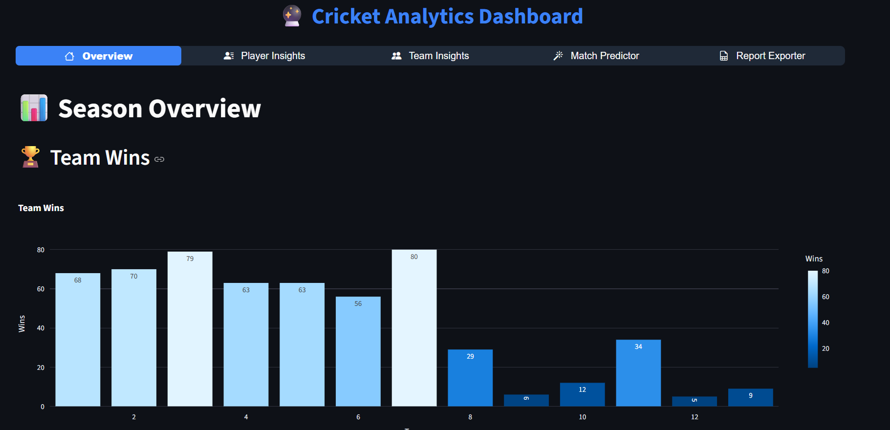

# Cricket Analytics Dashboard

A **modern interactive dashboard** for cricket analytics and match prediction, built with **Streamlit**. This project allows users to explore match and player insights, team statistics, and predicts match winners using machine learning models.

---

## Features

### 1. Overview

* Provides a general summary of matches, teams, and player statistics.
* Visualizations of key metrics and trends.

### 2. Player Insights

* Explore detailed statistics for individual players.
* Compare performance across seasons and matches.

### 3. Team Insights

* Analyze team performance metrics and win/loss trends.
* Compare different teams’ performance.

### 4. Match Predictor

* Predict the winner of a match using a **trained machine learning model**.
* Input options:

  * Team 1
  * Team 2
  * Toss Winner
  * Venue
* Handles categorical data with pre-saved **LabelEncoders**.

### 5. Report Exporter

* Export analytical reports in **CSV or Excel** formats.

---

## Screenshots



---

## Installation

1. **Clone the repository**

```bash
git clone https://github.com/Mamoonkhan11/Cricket_Analysis___Python
cd cricket-analytics-dashboard
```

2. **Create a virtual environment (recommended)**

```bash
python -m venv .venv
source .venv/bin/activate   # Linux / Mac
.venv\Scripts\activate      # Windows
```

3. **Install dependencies**

```bash
pip install -r requirements.txt
```

4. **Install additional package for modern navigation bar**

```bash
pip install streamlit-option-menu
```

---

## Usage

1. **Run the dashboard**

```bash
streamlit run main.py
```

2. Open your browser at the URL provided (usually `http://localhost:8501`).

3. Navigate through the top **modern navigation bar**:

   * Home / Overview
   * Player Insights
   * Team Insights
   * Match Predictor
   * Report Exporter

4. Use the **Match Predictor** tab to predict match winners using the ML model.

---

## Project Structure

```
Cricket-Analytics-Dashboard/
│
├─ assets/
│   ├─ styles.css       
│
├─ data/
│   ├─ matches.csv        
│   ├─ Team.csv       
│
├─ models/
│   ├─ match_predictor.pkl 
│   └─ encoders.pkl       
│
├─ pages/
│   ├─ Overview.py
│   ├─ Player_Insights.py
│   ├─ Team_Insights.py
│   ├─ Match_Predictor.py
│   └─ Report_Exporter.py
│
├─ main.py              
├─ requirements.txt    
└─ README.md             
```

---

## ML Model Details

* **Model**: Logistic Regression (or Random Forest if updated)
* **Features used**:

  * Team_Name_Id
  * Opponent_Team_Id
  * Toss_Winner_Id
  * Venue_Name
* **Target**: Match Winner (`winner`)
* Encoders are saved in `models/encoders.pkl` for all categorical columns.

---

## Contributing

1. Fork the repository
2. Create your feature branch (`git checkout -b feature/my-feature`)
3. Commit your changes (`git commit -am 'Add new feature'`)
4. Push to the branch (`git push origin feature/my-feature`)
5. Open a Pull Request

---